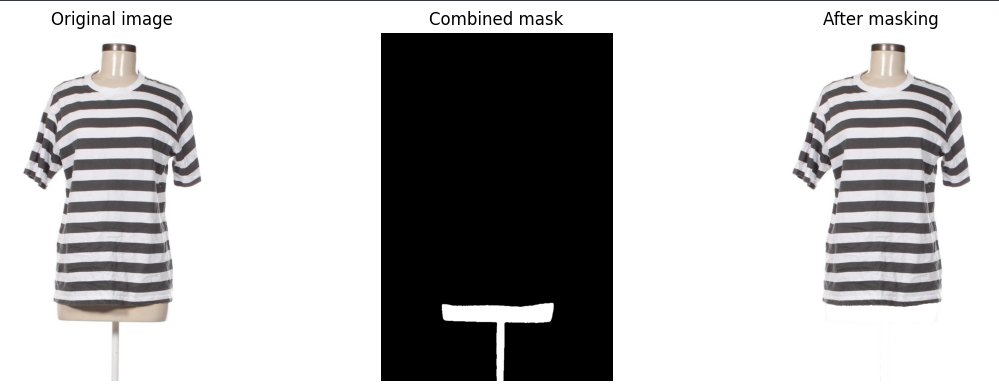

# Mannequin Segmentation Microservice

A Flask-based microservice that uses the EVF-SAM (Enhanced Vision Foundation - Segment Anything Model) to automatically remove mannequins and unwanted areas from clothing images. This preprocessing step significantly improves the accuracy of garment measurement systems by eliminating visual obstructions.

## Purpose

When measuring garments from photographs, mannequins, display tubes, and other supporting structures can interfere with accurate measurements. This microservice:

- **Segments and removes mannequins** from underneath clothing items
- **Eliminates display tubes and stands** that support garments
- **Replaces removed areas with clean white background**
- **Removes thin artifacts** and stripe noise from processing

The processed images can then be used by downstream measurement microservices for more precise garment analysis.

### Example Results



*The segmentation process: Original image with mannequin (left), generated mask (center), and final processed image with mannequin removed (right)*

## 🏗️ Architecture

```
┌─────────────────┐    ┌──────────────────┐    ┌─────────────────┐
│   Client App    │───▶│  Flask API       │───▶│   EVF-SAM       │
│                 │    │  (api_app.py)    │    │   Model         │
└─────────────────┘    └──────────────────┘    └─────────────────┘
                               │                         │
                               ▼                         │
┌─────────────────┐    ┌──────────────────┐             │
│   AWS S3        │◀───│  Image Storage   │◀────────────┘
│   Bucket        │    │  & Processing    │
└─────────────────┘    └──────────────────┘
```

### Key Components

- **Flask API** (`api_app.py`): RESTful endpoint for image processing requests
- **EVF-SAM Inferencer** (`evfsam.py`): Core image processing logic using computer vision
- **S3 Integration**: Automatic upload of processed images to AWS S3
- **Docker Support**: Containerized deployment for scalability

## Quick Start

### Prerequisites

- Python 3.9
- CUDA-capable GPU (recommended) or CPU
- AWS account with S3 access
- Docker (for containerized deployment)

### Environment Setup

1. **Clone and navigate to the project:**

```bash
git clone <your-repo>
cd mannequin-segmenter
```

2. **Create a `.env` file with your AWS credentials:**

```env
AWS_ACCESS_KEY_ID=your_access_key_here
AWS_SECRET_ACCESS_KEY=your_secret_key_here
AWS_S3_BUCKET_NAME=your_bucket_name
AWS_S3_REGION=us-east-1
```

3. **Choose your deployment method:**

#### Option A: Docker Deployment (Recommended)

```bash
# Build the container
docker build -t mannequin-segmenter .

# Run the service
docker run -p 5001:5001 --env-file .env mannequin-segmenter
```

#### Option B: Local Development

```bash
# Install dependencies
pip install flask torch boto3 python-dotenv
pip install -r EVF-SAM/requirements.txt

# Run the service
python api_app.py
```

## API Usage

### Process Image Endpoint

**POST** `/infer`

Processes an image URL to remove mannequins and unwanted areas.

#### Request Body

```json
{
  "image_url": "https://example.com/path/to/your/image.jpg"
}
```

#### Response

```json
{
  "visualization_url": "https://your-bucket.s3.region.amazonaws.com/2024/01/15/uuid.jpg"
}
```

#### Example Usage

**cURL:**

```bash
curl -X POST http://localhost:5001/infer \
  -H "Content-Type: application/json" \
  -d '{"image_url": "https://example.com/tshirt-on-mannequin.jpg"}'
```

**Python:**

```python
import requests

response = requests.post('http://localhost:5001/infer', json={
    'image_url': 'https://example.com/tshirt-on-mannequin.jpg'
})

result = response.json()
processed_image_url = result['visualization_url']
```

## 🔧 Configuration

### Model Settings

The EVF-SAM model can be configured in `evfsam.py`:

```python
inferencer = EVFSAMSingleImageInferencer(
    precision="fp16",           # fp32, fp16, or bf16
    use_bnb=False,             # 4-bit quantization for lower VRAM
    thickness_threshold=50      # Threshold for removing thin artifacts
)
```

### Segmentation Prompts

The service uses specific prompts to identify different areas:

- **Mannequin detection**: `"mark beige mannequin under the T-shirt"`
- **Tube detection**: `"mark only the vertical white-beige tube under the T-shirt"`

These can be modified in the `EVFSAMSingleImageInferencer` class.

## 🧪 Development & Testing

### Interactive Testing

Use the provided Jupyter notebook for development and testing:

```bash
jupyter notebook test_evfsam.ipynb
```

The notebook allows you to:

- Load the model once (expensive operation)
- Test multiple images quickly
- Visualize processing steps
- Experiment with different parameters

### Local Testing

```python
from evfsam import EVFSAMSingleImageInferencer

# Initialize model
inferencer = EVFSAMSingleImageInferencer()

# Process an image
result = inferencer.process_image_url(
    "https://example.com/image.jpg", 
    plot=True  # Shows visualization
)
```

## 🐳 Docker Deployment

### Building the Image

```bash
docker build -t mannequin-segmenter .
```

### Running with Different Configurations

**Development mode with volume mounting:**

```bash
docker run -p 5001:5001 \
  --env-file .env \
  -v $(pwd):/app \
  mannequin-segmenter
```

**Production mode:**

```bash
docker run -d \
  -p 5001:5001 \
  --env-file .env \
  --restart unless-stopped \
  --name mannequin-segmenter \
  mannequin-segmenter
```

## 🔍 How It Works

### Processing Pipeline

1. **Image Download**: Fetches image from provided URL
2. **Preprocessing**: Resizes and pads image for EVF-SAM model
3. **Segmentation**: Uses AI to identify mannequins, tubes, and unwanted areas
4. **Mask Application**: Replaces identified areas with white background
5. **Post-processing**: Removes thin artifacts and noise
6. **Storage**: Uploads processed image to S3 with date-based organization

### Segmentation Targets

- **Mannequins**: Beige/flesh-colored mannequin bodies under clothing
- **Display Tubes**: Vertical white/beige support tubes
- **Neck/Chest Areas**: Areas that might interfere with garment measurement

## 🔧 Troubleshooting

### Common Issues

**Model Download Issues:**

- Ensure AWS credentials are correctly configured
- Check internet connectivity for model downloads
- Verify S3 bucket permissions

**Memory Issues:**

- Use `use_bnb=True` for 4-bit quantization (reduces VRAM usage)
- Switch to `precision="fp32"` if using CPU
- Consider smaller batch sizes for processing

**Performance Optimization:**

- Use GPU when available (CUDA)
- Enable `fp16` precision on compatible hardware
- Use compiled model for repeated inference

### Logs and Debugging

Enable detailed logging by setting environment variables:

```bash
export PYTHONPATH=/app
export FLASK_DEBUG=1
```

## 📊 Performance

### Typical Processing Times

- **GPU (RTX 3080)**: <1 second per image
- **CPU (Intel i7)**: ~15-40 seconds per image
- **Model Loading**: ~30-60 seconds (one-time cost)

### Resource Requirements

- **RAM**: 4-8GB minimum
- **VRAM**: 6-8GB recommended for GPU inference
- **Storage**: ~5GB for model weights and dependencies

## 🔗 Integration

This microservice is designed to work with other garment measurement services:

```python
# Example integration workflow
def process_garment_image(image_url):
    # 1. Remove mannequin
    segmentation_response = requests.post(
        'http://mannequin-segmenter:5001/infer',
        json={'image_url': image_url}
    )
  
    # 2. Use cleaned image for measurements
    cleaned_image_url = segmentation_response.json()['visualization_url']
  
    # 3. Send to measurement service
    measurement_response = requests.post(
        'http://measurement-service:5002/measure',
        json={'image_url': cleaned_image_url}
    )
  
    return measurement_response.json()
```

## 📝 API Documentation

### Health Check

```
GET /
Returns: Service status and basic information
```

### Process Image

```
POST /infer
Content-Type: application/json
Body: {"image_url": "string"}
Returns: {"visualization_url": "string"}
```

## 🤝 Contributing

1. Fork the repository
2. Create a feature branch
3. Test your changes using the Jupyter notebook
4. Run unit test cases
5. If every unit test case is passed then submit a pull request with detailed description

## 🆘 Support

For issues and support:

- Check the troubleshooting section above
- Review logs for error details
- Ensure all environment variables are set correctly
- Verify AWS S3 permissions and connectivity
